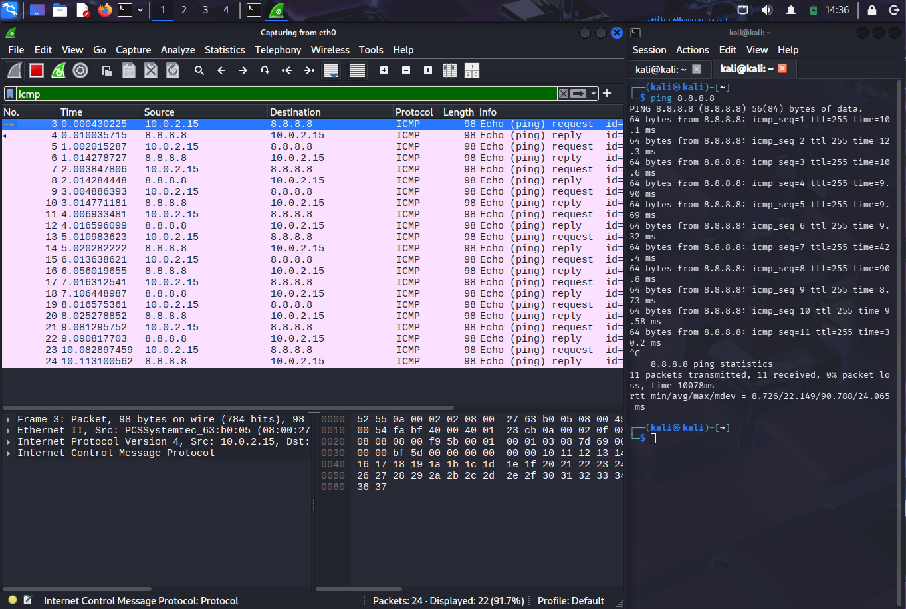
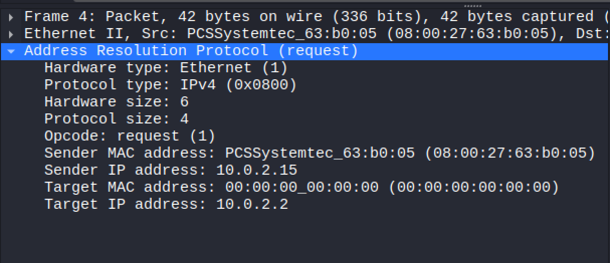
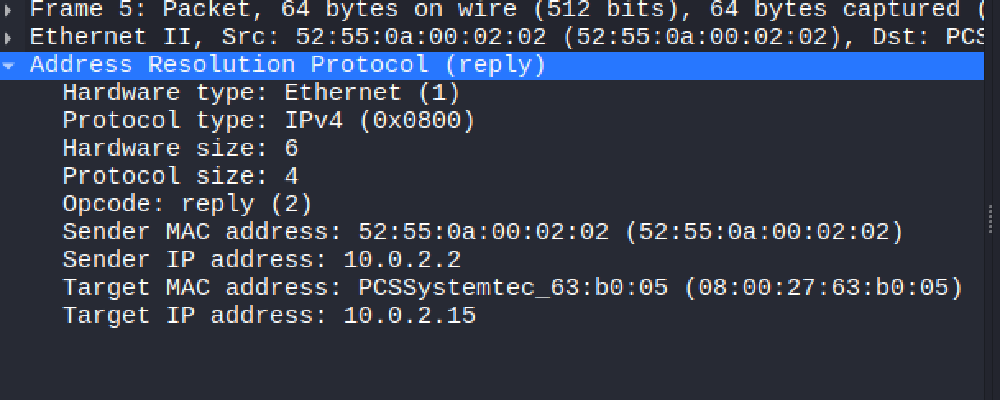

# ICMP Capture Lab
Overview:
This lab focuses on basic Wireshark traffic capture.

Goal:
The goal was to observe ICMP and ARP traffic.

What I did:
- Captured traffic on my active network interface
- Sent ping requests to another device
- Filtered traffic by protocol

What I observed:
- ARP requests are broadcast
- ICMP packets follow a request and reply pattern

What I learned:
- How to identify basic protocols
- How packet timing differs between tools 

Next steps:
- Capture TCP handshake traffic

Screenshots:

# ARP Traffic Lab
Overview
This lab focuses on observing ARP traffic on a local network.

Goal
The goal was to understand how devices resolve IP addresses to MAC addresses.

What I did
- Started a packet capture in Wireshark
- Generated local network traffic
- Applied an ARP filter

What I observed
- ARP requests are broadcast to all devices on the local network
- The ARP request originated from the local IP address 10.0.2.15, which is assigned to a virtual machine.
- ARP replies provide the MAC address for a specific IP

What I learned
- ARP operates at the local network level
- Devices must know MAC addresses before communication
- ARP traffic is visible to all local hosts

Screenshots

# TCP handshake Lab

Overview
This lab focuses on observing TCP connection behavior.

Goal
The goal was to identify the TCP three-way handshake and reset behavior.

What I did
- Captured network traffic while visiting a website
- Filtered traffic to show TCP packets
- Inspected TCP flags

What I observed
- TCP connections begin with a SYN, SYN-ACK, and ACK
- Reset packets appear when a connection is refused

What I learned
- TCP uses a three-step handshake to establish connections
- RST packets indicate closed or rejected connections
- Half-open connections occur when the handshake is not completed

Screenshots

)
