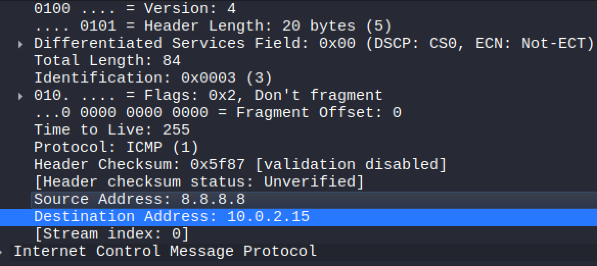

Overview:
This lab focuses on basic Wireshark traffic capture.

Goal:
The goal was to observe ICMP and ARP traffic.

What I did:
- Captured traffic on my active network interface
- Sent ping requests to another device
- Filtered traffic by protocol

What I observed:
- ARP requests are broadcast
- ICMP packets follow a request and reply pattern

What I learned:
- How to identify basic protocols
- How packet timing differs between tools 

Next steps:
- Capture TCP handshake traffic

Screenshots:

